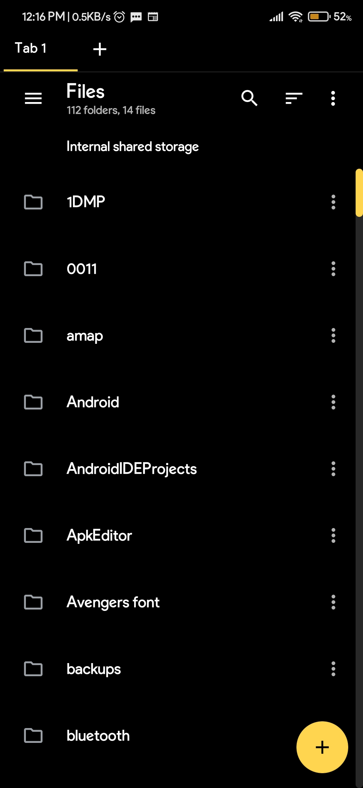
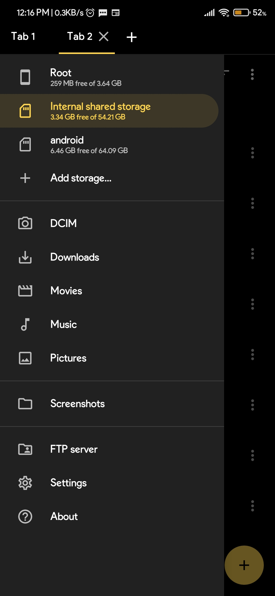
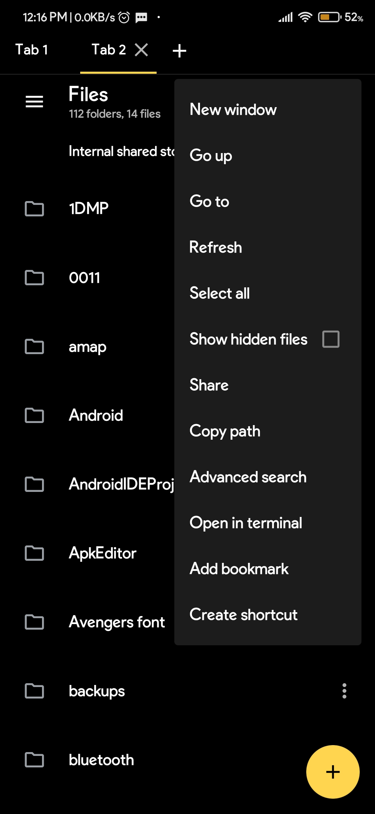
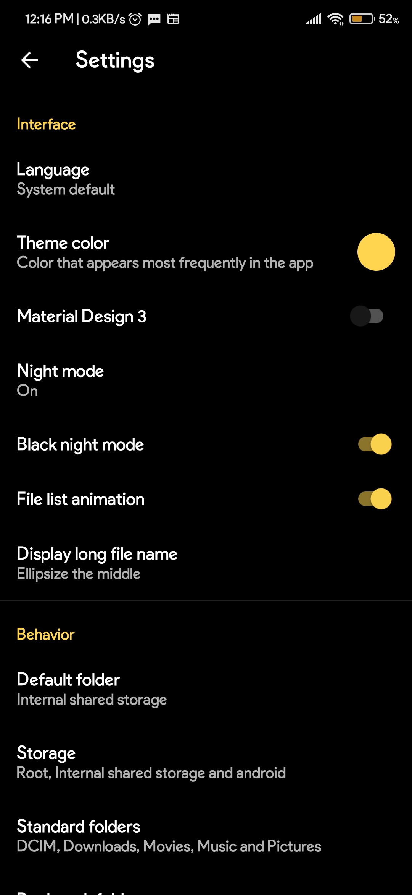
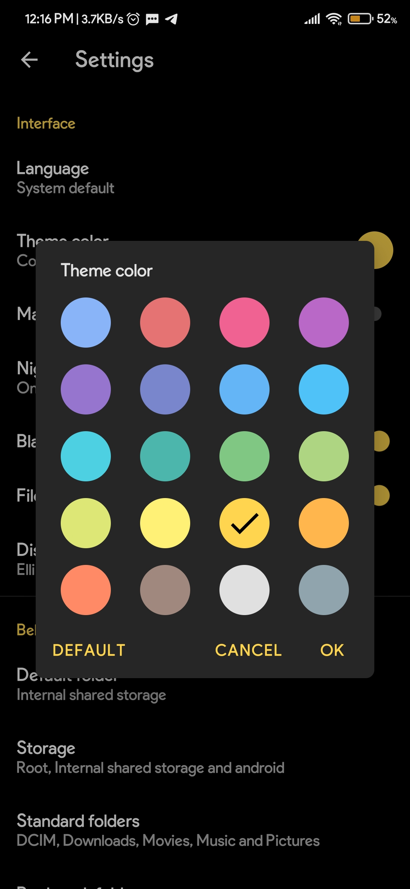

<div align="center">


# Sentry File Manager

### Powerful. Secure. Yours.

[](https://github.com/void-616/SentryFileManager/releases/latest)
[](LICENSE)
[](https://github.com/void-616/SentryFileManager/releases/latest)
[](https://t.me/SentryFileManager)

A modern, privacy-focused, open-source Android file manager built for power users who demand control.

[**⬇ Download Latest APK**](https://github.com/void-616/SentryFileManager/releases/latest)

</div>

---

## Screenshots

<div align="center">





</div>

---

## Features

### 🗂 File Management
- Browse, copy, move, rename, delete files and folders
- Multi-select with batch operations
- Archive support — view, extract and create ZIP, TAR, GZ, RAR, 7Z and more
- Root access support for system files

### 📑 Tabs
- Open multiple locations simultaneously with the tab system
- Each tab is independent — browse different folders at the same time

### 🔍 Advanced Search
- Search by name, file type, size range, and date
- Content search inside text files
- Scope control — current folder, subdirectories, or entire storage

### 💻 Terminal
- Built-in terminal emulator — open a shell directly from any folder
- Full key bar with ESC, TAB, CTRL, arrow keys, Home, End, PgUp, PgDn

### 🌐 Remote Storage
- Connect to FTP, SFTP, SMB and WebDAV servers
- Persistent connections — saved across app restarts

### ⚙️ Automation
- Create rules to automate file operations
- Trigger actions based on file events

### 🔌 Plugins
- Extensible plugin system for additional functionality

### 🎨 Theming
- 20+ theme colors to choose from
- Night mode with optional true black
- Material Design 2 and Material Design 3 support

### 🛡️ Privacy
- No ads, no tracking, no analytics
- All data stays on your device
- Fully open source — inspect every line of code

---

## Download

| Platform | Link |
|----------|------|
| GitHub Releases | [**Download APK**](https://github.com/void-616/SentryFileManager/releases/latest) |

> **Requirements:** Android 6.0 (API 23) or higher

---

## Build from Source

```bash
# Clone the repository
git clone https://github.com/void-616/SentryFileManager.git
cd SentryFileManager

# Build debug APK
./gradlew assembleDebug

# Build release APK (requires signing config)
./gradlew assembleRelease
```

Open in Android Studio for full development support.

---

## Contributing

Contributions are welcome. Please open an issue first to discuss what you would like to change.

- [Report a bug](https://github.com/void-616/SentryFileManager/issues/new)
- [Request a feature](https://github.com/void-616/SentryFileManager/issues/new)
- [Join Telegram](https://t.me/SentryFileManager)

---

## Credits

Sentry File Manager is based on [MaterialFiles](https://github.com/zhanghai/MaterialFiles) by [Hai Zhang](https://github.com/zhanghai), which is licensed under the GNU General Public License v3.0.

Additional features including tabs, terminal integration, automation, advanced search, crash logging, plugin system, and more have been built on top of the original project.

---

## License

```
Copyright (C) 2018 Hai Zhang
Copyright (C) 2026 Sentry Project

This program is free software: you can redistribute it and/or modify
it under the terms of the GNU General Public License as published by
the Free Software Foundation, either version 3 of the License, or
(at your option) any later version.
```

See [LICENSE](LICENSE) for the full license text.

---

## Privacy Policy

See [PRIVACY.md](PRIVACY.md) for the full privacy policy.

---

<div align="center">

Built with ♥ by Sentry

[GitHub](https://github.com/void-616) · [Telegram](https://t.me/SentryFileManager)

</div>
